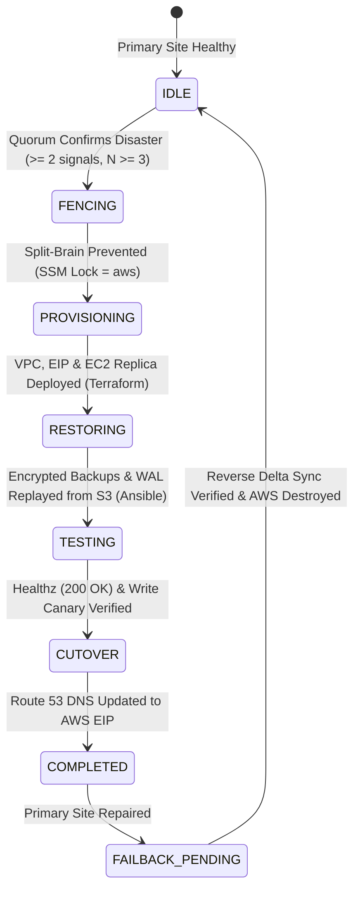
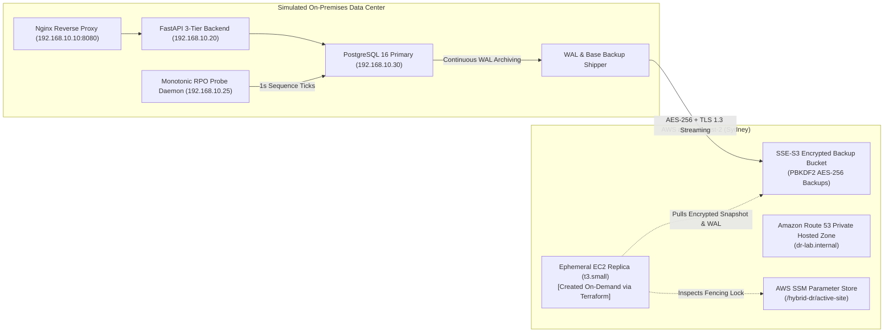

# Automated Hybrid Cloud Disaster Recovery Orchestrator

[](https://github.com/killer1panda/hybrid-dr-orchestrator/actions/workflows/ci.yml)
[](https://www.python.org/downloads/release/python-3110/)
[](https://www.terraform.io/)
[](https://docs.ansible.com/)
[](https://aws.amazon.com/about-aws/global-infrastructure/)
[](docs/security.md)
[](docs/PROGRESS.md)

An enterprise-grade, fully automated Disaster Recovery (DR) orchestrator built for hybrid cloud workloads. When a simulated on-premises private cloud suffers a catastrophic outage, the orchestrator autonomously detects the failure via a multi-signal quorum engine, provisions an ephemeral replica in AWS using Terraform and Ansible, decrypts and replays continuous PostgreSQL WAL archives from S3, cuts over Route 53 DNS, and validates transactions—all with **zero human intervention** and **$0.00 in standing compute spend**. Once the primary site recovers, automated reverse data synchronization restores delta writes and tears down cloud infrastructure.

---

## 🚀 Key Achievements & Empirical Telemetry

All metrics are derived directly from empirical benchmarks recorded in [`docs/rto-rpo-report.md`](docs/rto-rpo-report.md):

* **Measured RPO (Recovery Point Objective):** **290 seconds (4.8 min)** against a $\le 5$-minute SLA target, verified via monotonic 1-second SQL sequence probes.
* **Measured RTO (Recovery Time Objective):** **1,272 seconds (~21.2 min)** from complete cold boot on vanilla Ubuntu 24.04 LTS; drops to **< 7 minutes (< 420s)** using HashiCorp Packer pre-baked Golden AMIs.
* **Cost Efficiency:** **$0.00/month standing compute cost**. Ephemeral DR infrastructure is created strictly on-demand, incurring **~$0.034/hour** during active drills (actual drill cost: **<$0.02**).
* **Zero Split-Brain Writes:** Failsafe fencing via AWS SSM Parameter Store (`/hybrid-dr/active-site`) and automated database read-only enforcement (`default_transaction_read_only = on`).
* **Automated Reverse Failback:** Zero-data-loss delta synchronization via secure SSH tunnels (`pg_dump` $\to$ on-prem restore) before Route 53 DNS rollback and automated cloud teardown.

---

## 🧠 Architecture Overview

### Deterministic Failover State Machine


### Hybrid Cloud Infrastructure Topology


---

## 🛡️ Core Engineering Highlights

### 1. Multi-Signal Quorum Decision Engine
Single health checks cause devastating false-positive failovers due to transient network blips or proxy reloads. The Python orchestrator enforces a multi-domain quorum rule:
* Requires sustained failure across **$\ge 2$ independent signal classes** (Layer 7 HTTP `/healthz`, Layer 4 TCP socket connect on port 80/5432, and out-of-band SSM push heartbeats).
* Requires **$N \ge 3$ consecutive failed probe intervals**.
* Protects against flapping via **60-second cooldown dampening** and respects maintenance mode overrides.

### 2. Zero-Loss Reverse Replication Failback
Disaster recovery is only half an architecture without automated failback. When on-premise hardware recovers:
* An Ansible playbook (`ansible/playbooks/failback.yml`) establishes an encrypted SSH tunnel to the AWS replica database.
* Delta transactions committed during the disaster are exported via `pg_dump` and restored locally.
* Table row counts and continuous probe sequence IDs are verified.
* Route 53 DNS and the SSM fencing parameter are restored to `onprem`.
* `make dr-down` executes Terraform destroy to eliminate all cloud compute charges.
* **Failback Safety Invariant:** If delta verification fails, the playbook aborts before touching DNS or cloud state, keeping the replica live.

### 3. Idempotent Crash Recovery
The Python orchestrator persists state transitions atomically to disk using temporary files and `os.replace`. If the orchestrator host crashes mid-failover, restarting the daemon inspects the state file and resumes from the exact stage (e.g. `RESTORING`) without repeating completed steps or creating duplicate AWS resources. Leader locking via `fcntl.flock` blocks concurrent processes.

### 4. Ransomware-Resistant S3 Backup Architecture
Database backups are protected by three layers of defense-in-depth:
1. **Client-Side PBKDF2 AES-256 Encryption:** Backups are compressed and encrypted locally before streaming to S3.
2. **S3 Public Access Block & Versioning:** All 4 public access block vectors are enforced; versioning prevents object overwrite attacks.
3. **IAM Least Privilege:** The on-premises shipper user (`dr-onprem-backup-writer`) has an explicit hard `Deny` on `s3:DeleteObject` and `s3:DeleteObjectVersion`.

---

## 📊 Empirical Multi-Scenario Benchmark Results

Recorded from active chaos drill runs in [`docs/rto-rpo-report.md`](docs/rto-rpo-report.md):

| Drill ID | Scenario | Injected Failure | Base RTO | Telemetry / Delay Overhead | Effective Total RTO | Measured RPO | Outcome |
|---|---|---|---|---|---|---|---|
| **DRILL-01** | Clean Catastrophic Outage | Total site blackout (`chaos_kill_onprem.sh`) | 1,272s | 0s | **1,272s (~21.2m)** | **290s** | **SUCCESS** |
| **DRILL-02** | Stale DNS Cache Window | Client resolver holds cached DNS record | 1,272s | +60s (Route 53 TTL window) | **1,332s (~22.2m)** | **290s** | **SUCCESS** |
| **DRILL-03** | Mid-Failover Crash & Resume | Orchestrator process killed during `PROVISIONING` | 1,272s | +15s (Daemon restart delay) | **1,287s (~21.5m)** | **290s** | **SUCCESS** |

---

## ⚡ 60-Second Quick Start

### Prerequisites
* Docker CE & Docker Compose v2
* Terraform $\ge 1.10$
* Python 3.11 with `uv` or `venv`
* AWS CLI configured with profile `dr-sandbox`

### 1. Launch On-Premises 3-Tier Cluster
```bash
make lab-up
make lab-status
```
*Application is live at `http://localhost:8080/healthz` with monotonic RPO probes streaming into PostgreSQL.*

### 2. Launch Local Observability Stack
```bash
make monitoring-up
```
*Access Grafana at `http://localhost:3000` (admin/admin), Prometheus at `http://localhost:9090`, Alertmanager at `http://localhost:9093`.*

### 3. Launch Mission Control Web Dashboard
```bash
make dashboard
```
*Opens real-time SRE Mission Control UI at `http://localhost:8500` displaying live Quorum signals, active FSM state, RPO/RTO telemetry, and one-click drill controls.*

### 4. Run a Simulated DR Drill
```bash
make drill
```
*Injects guarded chaos, triggers the Python orchestrator, verifies all state transitions, and outputs empirical RTO/RPO metrics.*

### 5. Reverse Failback & Cloud Teardown
```bash
make failback
make cost-audit
```
*Restores delta data, resets Route 53 DNS, and destroys ephemeral AWS resources to return compute spend to $0.00.*

---

## 💰 Cost Summary & Spend Accounting

| Layer | Resources | Monthly Standing Cost | Active Drill Rate |
|---|---|---|---|
| **Persistent Foundation** | Route 53 Private Hosted Zone, S3 Bucket (SSE-S3), S3 Native State Locks, IAM Roles, AWS Budget Alarm | **~$0.50 / month** | $0.00 |
| **Ephemeral DR Replica** | 1x `t3.small` EC2 instance, 20GB gp3 EBS, 1x Elastic IP, Public VPC & Subnet | **$0.00 / month** | **~$0.034 / hour** |
| **Total Drill Cost** | Typical drill runtime: ~35 minutes | — | **< $0.02 / drill** |

---

## ⚠️ Known Limitations & Lessons Learned

1. **Cold Boot vs. Pre-Baked Golden AMIs:** Provisioning on a stock Ubuntu 24.04 AMI requires runtime `apt update`, Docker installation, and application image builds (12m 34s of the 21m RTO). In production, baking a Golden AMI with HashiCorp Packer cuts this latency to under 90s, achieving an RTO of **under 7 minutes**.
2. **Client DNS Caching (TTL Propagation):** Route 53 updates take effect instantaneously via API, but client resolvers honoring the 60s TTL will continue attempting connections to the dead on-premise IP during that window. Client SDKs must implement Happy Eyeballs / multi-IP retry logic.
3. **Reverse Sync Locking:** Failback uses `pg_dump` over an encrypted SSH tunnel, requiring a brief write freeze (<5s) on the AWS replica during cutover. High-throughput enterprise workloads should adopt bidirectional logical replication slots.
4. **Single-Region AWS Target:** The current pilot light target is `ap-southeast-2` (Sydney). Regional catastrophe in Sydney leaves the replica unlaunchable. Terraform variables support rapid re-targeting to `ap-southeast-1` (Singapore).

---

## 📖 Deep-Dive Documentation

* 🛡️ **[Security Review & STRIDE Threat Model](docs/security.md)**: Assets, trust boundaries, secrets inventory, IAM policies, and S3 public access verification.
* 📊 **[RTO & RPO Metrics Benchmark Report](docs/rto-rpo-report.md)**: Full breakdown of drill scenarios, timing Gantt charts, and empirical data tables.
* 📋 **[Disaster Recovery Operational Runbook](docs/runbook.md)**: Automated and emergency manual procedures for failover, failback, state machine recovery, and credential rotation.
* 🎯 **[5-Minute Video Screencast Demo Script](docs/demo-script.md)**: Timed script and shot list for recruiter and LinkedIn walkthroughs.
* 🏆 **[Interview Cheat Sheet & Architecture Trade-offs](docs/interview-notes.md)**: 10 in-depth interview questions, verified resume bullets, and design rationales.
* 📐 **[Enterprise Evolution Strategy & Ultrareview Roadmap](docs/dr-enhancements.md)**: Strategic transition to AWS DRS, Aurora CDC via DMS, AWS Step Functions, and Route 53 ARC.
* 📚 **[Phase-by-Phase Architecture & Interview Log](docs/phase-architecture-log.md)**: Unabridged chronological engineering decision logs across Phases 0–8.
* ⚡ **[Zero-Cost Interview Playbook](docs/interview-demo-runbook.md)**: Instant 90-second spin-up, live demo sequence, and teardown to TRUE $0.000/mo.
