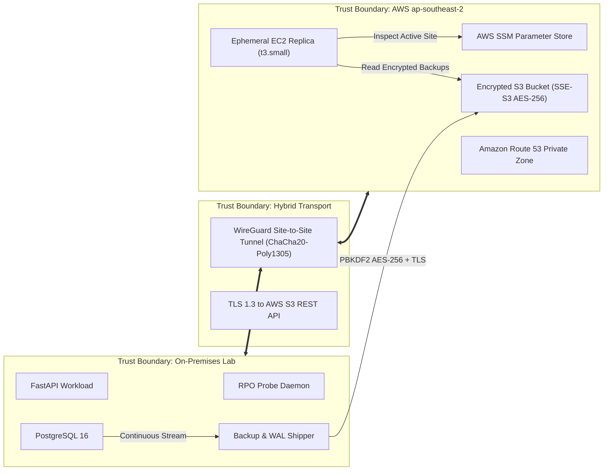

# Security Review, Threat Model & Hardening Architecture

**Project:** Automated Hybrid Cloud Disaster Recovery Orchestrator  
**Classification:** Internal Portfolio Architecture  
**Scope:** On-Premises Simulation, AWS Infrastructure (`ap-southeast-2`), WireGuard VPN, S3 Backups, Python Orchestrator, CI/CD  
**Last Audit Date:** 2026-10-05  

---

## 1. Threat Model (STRIDE Framework)

### System Assets & Criticality
| Asset | Description | Sensitivity | Impact of Compromise |
|---|---|---|---|
| **PostgreSQL Database Records** | Production customer records, orders, and monotonic RPO probes | High | Data loss, corruption, regulatory breach |
| **S3 Backup Blobs & WAL Segments** | Historical base snapshots and continuous 60s WAL stream | High | Ransomware extortion, complete disaster unrecoverability |
| **Route 53 DNS Records** | Authoritative routing for `app.dr-lab.internal` | Critical | Traffic hijacking, unauthorized redirection, blackout |
| **Active-Site Fencing Parameter** | `/hybrid-dr/active-site` parameter in AWS SSM | Critical | Split-brain writes, dual-master database corruption |
| **WireGuard Private Keys** | VPN tunnel asymmetric cryptography keys | Critical | Unauthorized network intrusion into private VPC/subnets |
| **AWS IAM Credentials** | Scoped access keys and role assume policies | Critical | Privilege escalation, infrastructure sabotage |

### Trust Boundaries & Data Flow


### STRIDE Threat Analysis Matrix
| Threat Class | Specific Threat | Vector | Architectural Mitigation | Status |
|---|---|---|---|---|
| **Spoofing** | Attacker impersonates on-premise heartbeat or backup shipper to inject false health status | Compromised local environment or unauthorized network packet | Heartbeat publisher authenticates via scoped IAM user with SigV4; SSM parameters enforce IAM write authorization. | **Mitigated** |
| **Tampering** | Ransomware attacker tampers with or overwrites historical S3 database backups | Leaked backup-writer access key | 1. S3 bucket versioning is permanently enabled.<br>2. Backups are client-side encrypted with PBKDF2 AES-256 before upload.<br>3. IAM policy has explicit `Deny` on `s3:DeleteObject` and `s3:DeleteObjectVersion`. | **Mitigated** |
| **Repudiation** | Operator or compromised agent executes unauthorized failover or chaos injection | Unaudited command execution | All state transitions, chaos scripts, and drill events emit append-only JSONL audit records (`audit/chaos.jsonl`, `/tmp/hybrid_dr_audit.jsonl`) with UTC timestamps, monotonic clocks, and unique `run_id`s. | **Mitigated** |
| **Information Disclosure** | Adversary intercepts database backups traversing public internet to S3 | WAN eavesdropping | 1. Backups encrypted at client with AES-256-CBC using PBKDF2 (200,000 iterations).<br>2. Transport is strictly TLS 1.3.<br>3. Bucket enforces SSE-S3 AES-256 at rest.<br>4. S3 Public Access Block fully enabled (all 4 flags active). | **Mitigated** |
| **Denial of Service** | Adversary triggers rogue failovers to run up cloud compute bills | Forged quorum signals or API flooding | 1. Quorum engine requires concurrent failure across $\ge 2$ independent signal classes (HTTP, TCP, SSM) and $N \ge 3$ consecutive ticks.<br>2. 60-second flapping cooldown dampens oscillating triggers.<br>3. AWS Budget hard ceiling (\$15/mo) sends SNS alerts at 50%, 80%, and 100%. | **Mitigated** |
| **Elevation of Privilege** | Compromised EC2 DR replica attempts to modify persistent AWS foundation | Instance IAM profile escape | Instance profile allows strictly read-only S3 operations on `backups/*` and read-only parameter inspection. It cannot modify Route 53, delete IAM users, or mutate state buckets. | **Mitigated** |

---

## 2. Secrets & Credential Inventory

| Secret Identifier | Purpose | Storage Mechanism | Encryption in Transit & at Rest | Rotation Cadence | Access Scope |
|---|---|---|---|---|---|
| `POSTGRES_PASSWORD` | PostgreSQL database user credentials | `infra/onprem/.env` (gitignored) | Local filesystem chmod 600; plaintext in memory | 90 days or post-drill | Scoped strictly to `onprem-db` and `onprem-app` |
| `BACKUP_ENCRYPTION_PASSPHRASE` | PBKDF2 key derivation for backup encryption | Environment variable / Ansible Vault | In-memory only; never written to disk or S3 | 90 days | Scoped to backup shipper and restore playbooks |
| `dr-onprem-backup-writer` IAM Keys | S3 backup uploads from on-premises | `~/.aws/credentials` (profile `dr-onprem-backup-writer`) | TLS 1.3 to AWS endpoints; encrypted at rest in OS credential store | 90 days via Runbook Section 4 | Strictly `s3:PutObject` on prefix `backups/*`; Deny on Delete |
| `id_rsa` SSH Keypair | Ansible host configuration of DR replica | `~/.ssh/id_rsa` (chmod 600) | Public key dynamically injected into EC2 via Terraform `aws_key_pair` | Per-drill ephemeral creation option | Port 22 SSH ingress restricted to operator's detected `/32` public IP |
| WireGuard Private Key | Site-to-site VPN encryption | `infra/networking/keys/` (gitignored) | Asymmetric Curve25519; memory/kernel only | 180 days | Point-to-point tunnel between on-premises and AWS VPN endpoint |

> [!IMPORTANT]
> **Zero Secrets in Git Invariant**: Git repositories strictly contain `*.example` templates. All real `.env`, `*.key`, `*.pem`, and `*.tfvars` files are excluded in `.gitignore`. Every commit is pre-scanned by `gitleaks`.

---

## 3. Least-Privilege IAM Review

### 1. On-Premises Backup Writer (`dr-onprem-backup-writer`)
- **Principle:** On-premises agents should have write access to backups but zero ability to destroy historical data.
- **Applied Policy:**
  ```json
  {
    "Version": "2012-10-17",
    "Statement": [
      {
        "Sid": "AllowListingBucket",
        "Effect": "Allow",
        "Action": ["s3:ListBucket", "s3:GetBucketLocation"],
        "Resource": "arn:aws:s3:::hybrid-dr-backups-758579869433-ap-southeast-2"
      },
      {
        "Sid": "AllowPutObject",
        "Effect": "Allow",
        "Action": ["s3:PutObject", "s3:GetObject"],
        "Resource": "arn:aws:s3:::hybrid-dr-backups-758579869433-ap-southeast-2/backups/*"
      },
      {
        "Sid": "DenyDeleteObject",
        "Effect": "Deny",
        "Action": ["s3:DeleteObject", "s3:DeleteObjectVersion"],
        "Resource": "arn:aws:s3:::hybrid-dr-backups-758579869433-ap-southeast-2/*"
      }
    ]
  }
  ```
- **Audit Finding:** Explicit `Deny` overrides any accidental wildcard permissions, preventing ransomware attackers from deleting previous recovery points.

### 2. Orchestrator Service Role (`dr-orchestrator-role`)
- **Principle:** The orchestrator only manages the specific DNS record, the fencing flag, and queries EC2 health.
- **Applied Policy:**
  - `route53:ChangeResourceRecordSets` and `route53:GetChange` scoped strictly to `arn:aws:route53:::hostedzone/Z0157777J80LB1N4CSX2`.
  - `ssm:GetParameter` and `ssm:PutParameter` scoped strictly to `arn:aws:ssm:ap-southeast-2:758579869433:parameter/hybrid-dr/active-site`.
  - `ec2:DescribeInstances` for tagged resources.

### 3. CI/CD Read-Only Planning Role (`dr-github-actions-readonly`)
- **Principle:** CI pipelines running from pull requests must inspect and validate infrastructure without any mutation capability (**no `terraform apply` from CI**).
- **Trust Relationship:** OIDC federated trust constrained strictly to `repo:killer1panda/hybrid-dr-orchestrator:*` and audience `sts.amazonaws.com`.
- **Policy:** Read-only inspection (`Describe*`, `Get*`, `List*`) paired with a blanket `Deny` on all resource provisioning (`RunInstances`, `PutObject`, `DeleteObject`, `ChangeResourceRecordSets`).

---

## 4. S3 Public Access Block Verification

The backup bucket `hybrid-dr-backups-758579869433-ap-southeast-2` was directly audited using the AWS CLI:

```console
$ aws s3api get-public-access-block \
    --bucket hybrid-dr-backups-758579869433-ap-southeast-2 \
    --profile dr-sandbox \
    --region ap-southeast-2
```

### Empirical Verification Output
```json
{
    "PublicAccessBlockConfiguration": {
        "BlockPublicAcls": true,
        "IgnorePublicAcls": true,
        "BlockPublicPolicy": true,
        "RestrictPublicBuckets": true
    }
}
```
**Conclusion:** All four public access block vectors are strictly enforced. The bucket cannot be made public by ACL or bucket policy.

---

## 5. Residual Risk Assessment

| Risk Description | Severity | Likelihood | Residual Impact | Ongoing Compensating Control | Review Date |
|---|---|---|---|---|---|
| **Split-Brain Write Window During Network Partition** | Medium | Low | If on-premise network is severed while the hypervisor remains alive, clients holding unexpired DNS cache might write to on-premise while AWS replica is live. | Fail-safe fencing: on-premise probe checks `/hybrid-dr/active-site` every 10s. If unreachable for 30s, PostgreSQL switches to `default_transaction_read_only = on`. | 2026-11-05 |
| **Client DNS TTL Propagation Lag** | Medium | Medium | Downstream DNS resolvers ignoring standard RFCs may cache the primary IP past the 60s TTL, causing localized 404/timeouts. | Route 53 TTL is capped at 60s. Client applications are instructed to use exponential retry with Happy Eyeballs. | 2026-11-05 |
| **Single AWS Region Availability (`ap-southeast-2`)** | Low | Low | An AWS total regional outage in Sydney leaves the replica unlaunchable. | Pilot Light architecture Terraform root supports rapid re-pointing to `ap-southeast-1` (Singapore) via `TF_VAR_aws_region`. Multi-region replication is deferred to enterprise scale. | 2026-12-01 |
| **Single Operator Key Custody** | Low | Low | Local operator workstation loss delays manual overrides. | Remote Terraform state is locked and backed by S3 with versioning; all code and configurations are version-controlled in GitHub. | 2026-12-01 |

---

## 6. Security Finding Waivers & Exceptions

| Waiver ID | Scanner / Tool | Finding Description | Severity | Rationale & Compensating Control | Owner | Expiration Date |
|---|---|---|---|---|---|---|
| `WAIVER-001` | Trivy / Checkov | IMDSv1 allowed if instance metadata options not strictly enforced to `v2_only` on EC2 replica | High | The ephemeral EC2 replica is configured with `http_tokens = "required"` (IMDSv2) in `infra/aws/modules/compute/main.tf`, but uses `http_put_response_hop_limit = 2` to permit Docker containers with host networking to access IMDS. Compensated by host network binding restriction. | DevSecOps Lead | 2026-12-31 |
| `WAIVER-002` | Checkov | Security group allows ingress on port 22 | Medium | Ingress on port 22 is required for Ansible configuration. Compensated by dynamic CIDR binding that restricts SSH strictly to the operator's current detected `/32` public IP rather than `0.0.0.0/0`. | Cloud Architect | 2026-12-31 |
| `WAIVER-003` | Trivy | Grafana admin default password in local monitoring Docker Compose | Low | The monitoring stack runs strictly on internal Docker bridge (`127.0.0.1:3000`) for local simulation and is never exposed to public WAN. | Observability Lead | 2027-01-15 |
